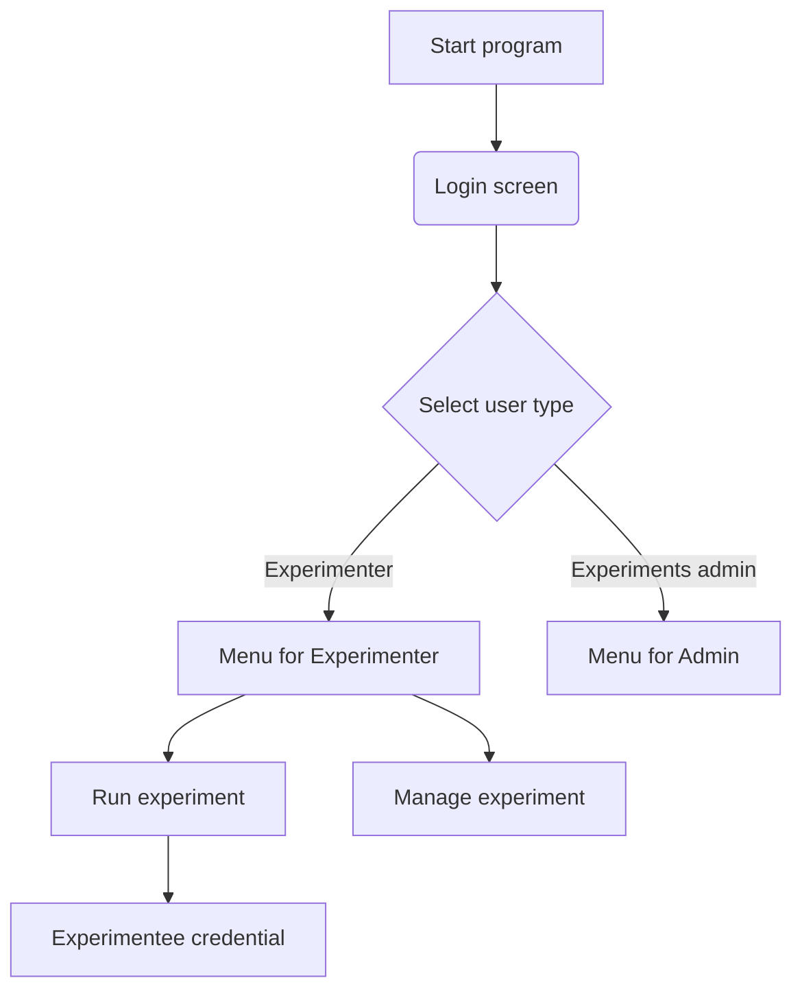

```mermaid
flowchart TD
    A[Start program] --> B(Login screen)
    B --> C{Select user type}
    C -->|Experimenter| E[Menu for Experimenter]
    C -->|Experiments admin| F[Menu for Admin]
    E --> E11[Run experiment]
    E --> E12[Manage experiment]
    E11 --> E13[Experimentee credential] 
```