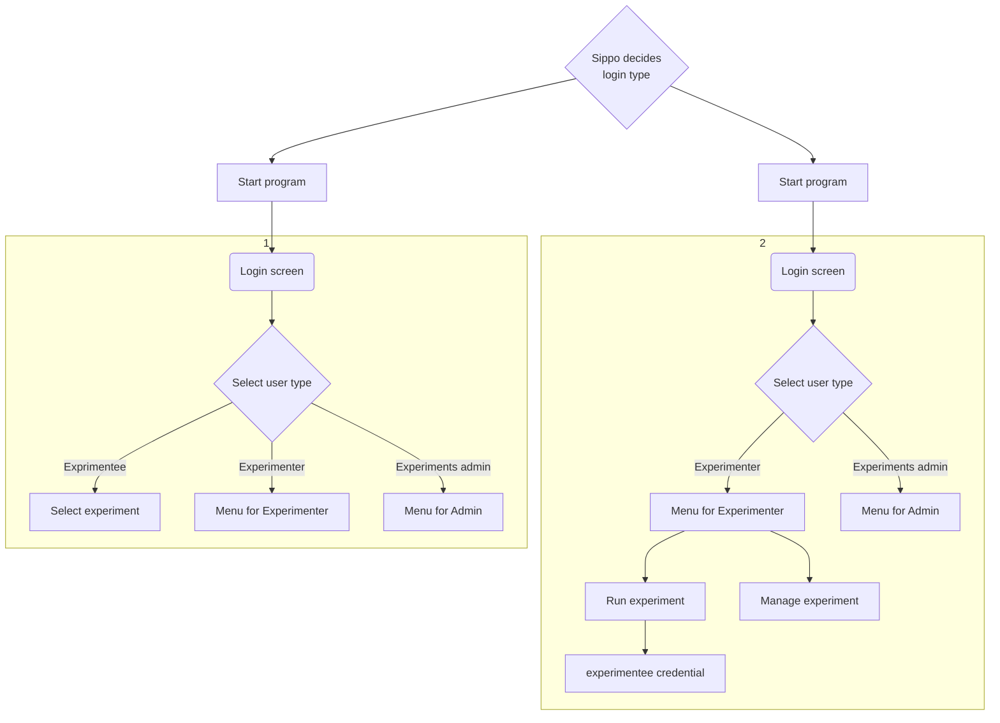

```mermaid
flowchart TD
    A0{Sippo decides\n login type} --> A1
    A0 --> A2
    A1[Start program] --> B
    A2[Start program] --> B2(Login screen)
    subgraph 1
    B(Login screen)
    B --> C{Select user type}
    C -->|Exprimentee| D[Select experiment]
    C -->|Experimenter| E[Menu for Experimenter]
    C -->|Experiments admin| F[Menu for Admin]
    end
    subgraph 2
    B2 --> C2{Select user type}
    C2 -->|Experimenter| E2[Menu for Experimenter]
    C2 -->|Experiments admin| F2[Menu for Admin]
    E2 --> E11[Run experiment]
    E2 --> E12[Manage experiment]
    E11 --> E13[experimentee credential] 

    end
```
