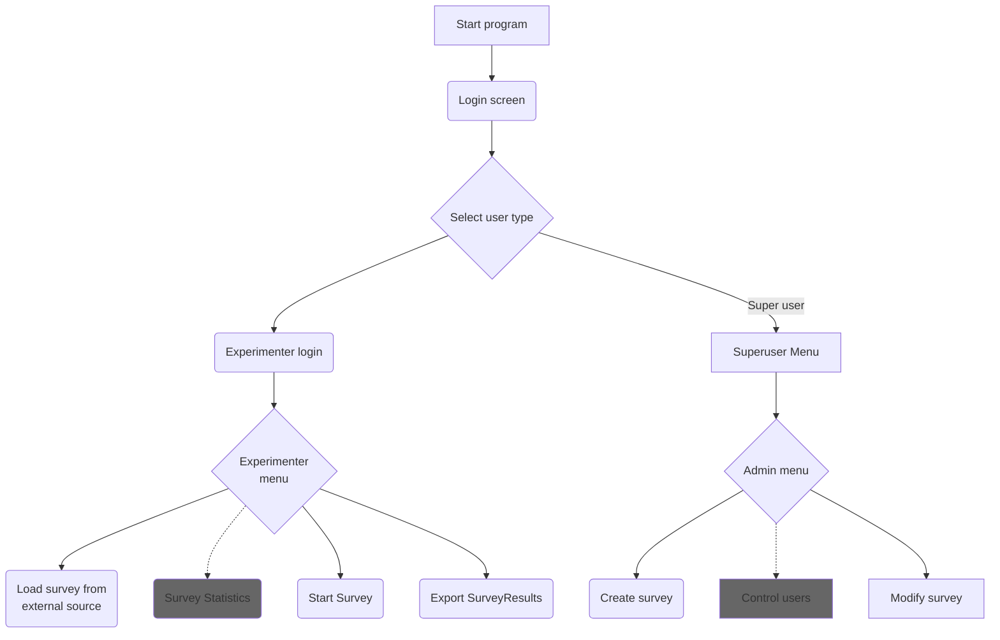

```mermaid
flowchart TD
    A[Start program] --> B(Login screen)
    B --> C{Select user type}
    C --> exp_login
    exp_login(Experimenter login)
    exp_login --> exp_menu{Experimenter\n menu}
    exp_menu --> load_survey(Load survey from\n  external source)
    admin_menu --> create_survey(Create survey)
    exp_menu -.-> survey_statistics(Survey Statistics)
    exp_menu --> run_experiment(Start Survey)
    exp_menu --> import_data(Export SurveyResults)
    C -->|Super user| admin_login[Superuser Menu]
    admin_login --> admin_menu{Admin menu}
    admin_menu -.-> admin_control[Control users]
    admin_menu --> admin_edit_survey[Modify survey]
    style admin_control fill:#666
    style survey_statistics fill:#666
```