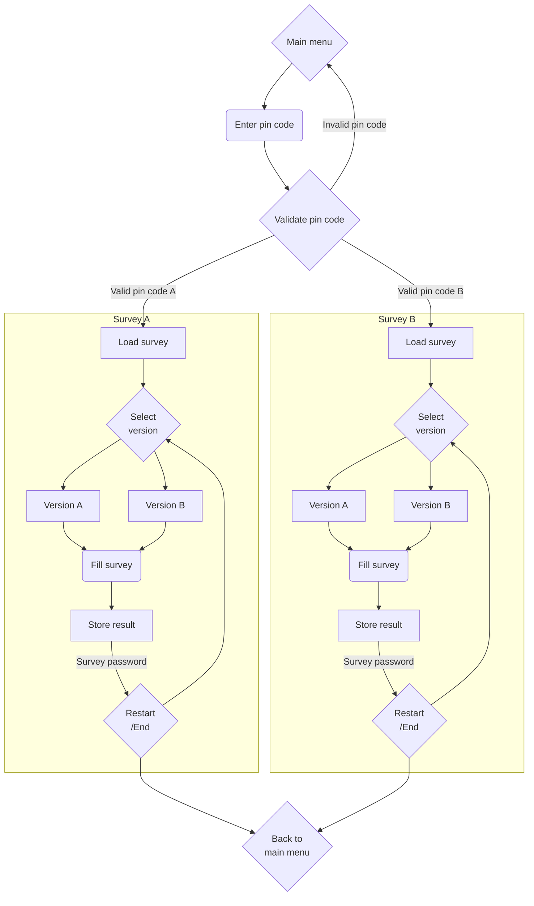

```mermaid
flowchart TD
    Start{Main menu} -->A1(Enter pin code)
    A1 --> A11{Validate pin code}
    A11 --> |Invalid pin code|Start
    A11 --> |Valid pin code A|B1Start[Load survey]
    A11 --> |Valid pin code B|B2Start[Load survey]    
    subgraph Survey A
    B1Start --> B1{Select \nversion}
    B1 --> B1.1[Version A]
    B1 --> B1.2[Version B]
    B1.1 --> B1Done(Fill survey)  
    B1.2 --> B1Done
    B1Done --> B1DoneStore[Store result]
    B1DoneStore -->|Survey password|B1Final{Restart\n/End}    
    B1Final --> B1
    end
    B1Final --> A12{Back to \n main menu}
    subgraph Survey B
    B2Start --> B2{Select \nversion}
    B2 --> B2.1[Version A]
    B2 --> B2.2[Version B]
    B2.1 --> B2Done(Fill survey)  
    B2.2 --> B2Done
    B2Done --> B2DoneStore[Store result]
    B2DoneStore --> |Survey password|B2Final{Restart\n/End}   
    B2Final --> B2       
    end    
    B2Final --> A12
```