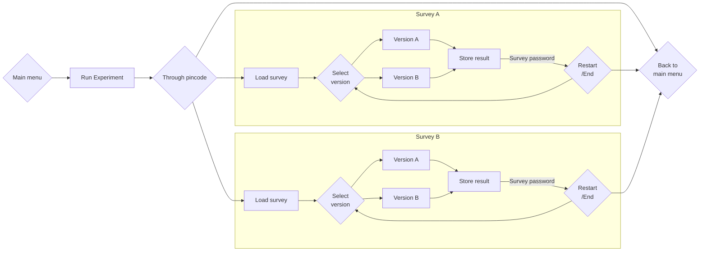

```mermaid
flowchart LR
    Start{Main menu} -->A1[Run Experiment]
    A1 --> A11{Through pincode}
    A11 --> A12{Back to \n main menu}
    subgraph Survey A
    B1Start --> B1{Select \nversion}
    B1 --> B1.1[Version A]
    B1 --> B1.2[Version B]
    B1.1 --> B1Done[Store result]    
    B1.2 --> B1Done
    B1Done --> |Survey password|B1Final{Restart\n/End}    
    B1Final --> B1
    end
    B1Final --> A12
    A11 --> B2Start[Load survey]    
    subgraph Survey B
    B2Start --> B2{Select \nversion}
    B2 --> B2.1[Version A]
    B2 --> B2.2[Version B]
    B2.1 --> B2Done[Store result]    
    B2.2 --> B2Done
    B2Done --> |Survey password|B2Final{Restart\n/End}   
    B2Final --> B2       
    end    
    A11 --> B1Start[Load survey]
    B2Final --> A12
```