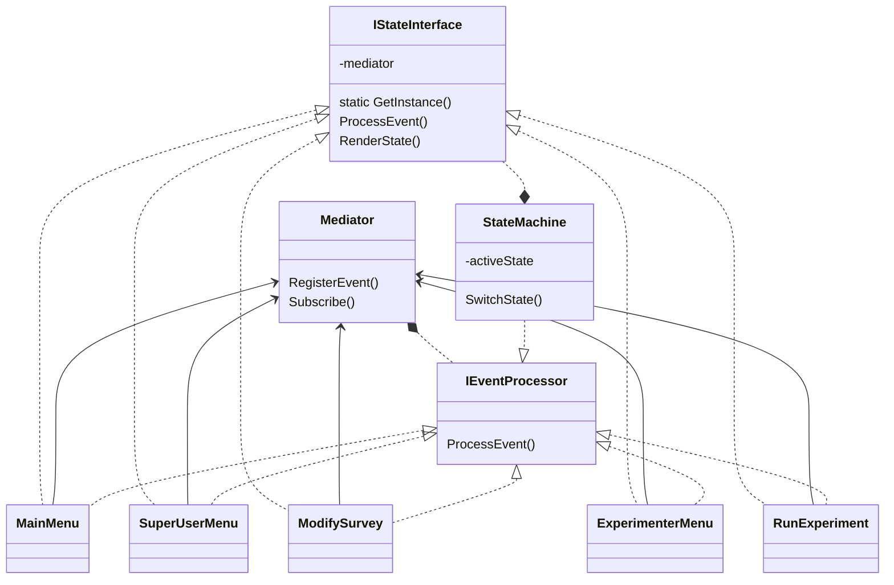

```mermaid
classDiagram

    class StateMachine{
        -activeState
        SwitchState()
    }

    class IEventProcessor{
        ProcessEvent()
    }
    class IStateInterface{
        -mediator
        static GetInstance()
        ProcessEvent()
        RenderState()
    }
    class Mediator{
        RegisterEvent()
        Subscribe()
    }

    IStateInterface     ..* StateMachine
    IStateInterface     <|.. MainMenu
    IStateInterface     <|.. SuperUserMenu
    IStateInterface     <|.. ModifySurvey
    IStateInterface     <|.. ExperimenterMenu
    IStateInterface     <|.. RunExperiment
    Mediator            <--     MainMenu           
    Mediator            <--     SuperUserMenu       
    Mediator            <--     ModifySurvey        
    Mediator            <--     ExperimenterMenu    
    Mediator            <--     RunExperiment       
    Mediator *.. IEventProcessor
    IEventProcessor     <|.. MainMenu
    IEventProcessor     <|.. SuperUserMenu
    IEventProcessor     <|.. ModifySurvey
    IEventProcessor     <|.. ExperimenterMenu
    IEventProcessor     <|.. RunExperiment
    StateMachine        ..|> IEventProcessor

```