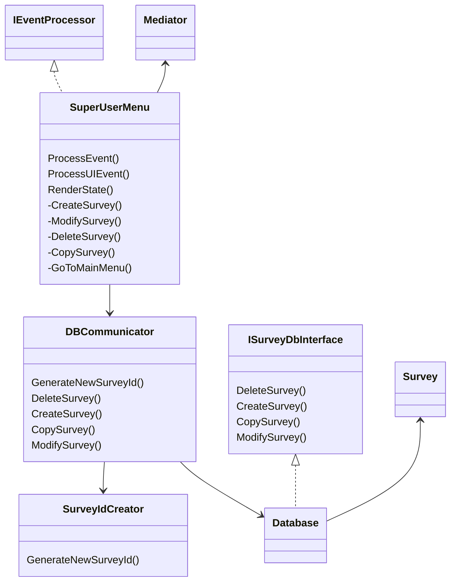

```mermaid
classDiagram

    class SuperUserMenu{
        ProcessEvent()
        ProcessUIEvent()
        RenderState()
        -CreateSurvey()
        -ModifySurvey()
        -DeleteSurvey()
        -CopySurvey()
        -GoToMainMenu()
    }

    class DBCommunicator{
        GenerateNewSurveyId()
        DeleteSurvey()
        CreateSurvey()
        CopySurvey()
        ModifySurvey()
    }

    class SurveyIdCreator{
        GenerateNewSurveyId()
    }

    class ISurveyDbInterface{
        DeleteSurvey()
        CreateSurvey()
        CopySurvey()
        ModifySurvey()
    }


    IEventProcessor     <|.. SuperUserMenu
    Mediator            <--  SuperUserMenu
    ISurveyDbInterface  <|.. Database
    Survey              <--  Database
    DBCommunicator      -->  SurveyIdCreator
    DBCommunicator      -->  Database
    SuperUserMenu       -->  DBCommunicator
```
