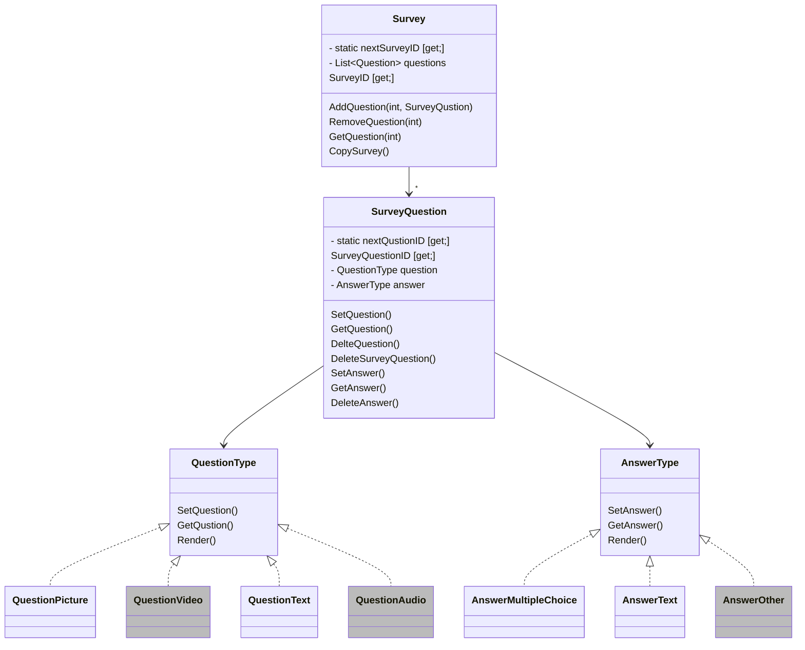

```mermaid
classDiagram
    class Survey{
        - static nextSurveyID [get;]
        - List~Question~ questions
        SurveyID [get;]
        AddQuestion(int, SurveyQustion)
        RemoveQuestion(int)
        GetQuestion(int)
        CopySurvey()
    }
        
    class SurveyQuestion{
        - static nextQustionID [get;]
        SurveyQuestionID [get;]
        - QuestionType question
        - AnswerType answer
        SetQuestion()
        GetQuestion()
        DelteQuestion()
        DeleteSurveyQuestion()
        SetAnswer()
        GetAnswer()
        DeleteAnswer()
    }

    class QuestionType{
        SetQuestion()
        GetQustion()
        Render() 
    }
    class AnswerType{
        SetAnswer()
        GetAnswer()
        Render() 
    }
    class QuestionVideo
    style QuestionVideo fill:#bbb
    class QuestionAudio
    style QuestionAudio fill:#bbb
    class AnswerOther
    style AnswerOther fill: #bbb

    Survey --> "*" SurveyQuestion
    SurveyQuestion -->  QuestionType
    SurveyQuestion --> AnswerType
    QuestionType <|.. QuestionPicture
    QuestionType <|..  QuestionVideo 
    QuestionType <|.. QuestionText
    QuestionType <|.. QuestionAudio
    AnswerType <|.. AnswerMultipleChoice
    AnswerType <|.. AnswerText
    AnswerType <|.. AnswerOther
    
```