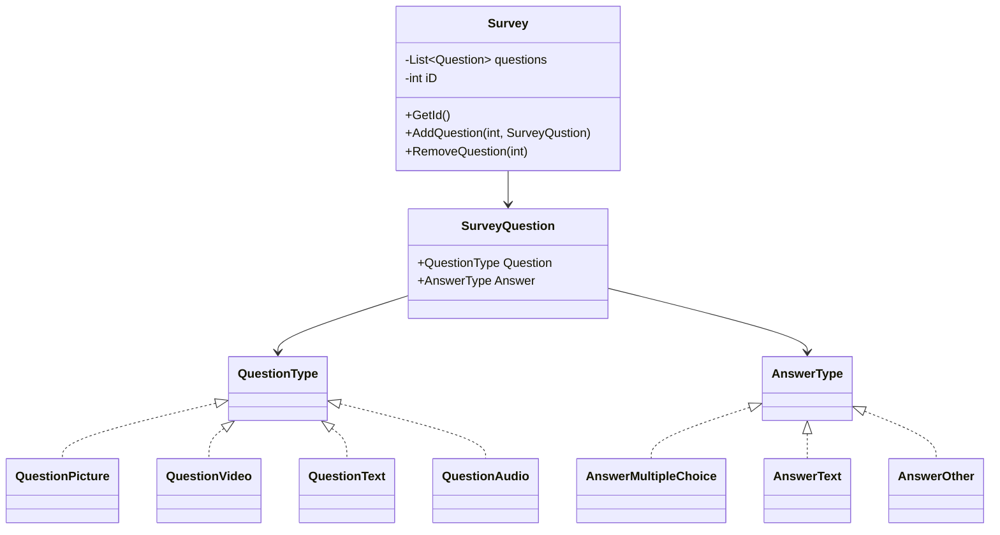

```mermaid
classDiagram
    class Survey{
        -List~Question~ questions
        -int iD
        +GetId()
        +AddQuestion(int, SurveyQustion)
        +RemoveQuestion(int)
    }
        
    class SurveyQuestion{
        +QuestionType Question
        +AnswerType Answer
    }
    Survey --> SurveyQuestion
    SurveyQuestion --> QuestionType
    SurveyQuestion --> AnswerType
    QuestionType <|.. QuestionPicture
    QuestionType <|.. QuestionVideo
    QuestionType <|.. QuestionText
    QuestionType <|.. QuestionAudio
    AnswerType <|.. AnswerMultipleChoice
    AnswerType <|.. AnswerText
    AnswerType <|.. AnswerOther
    
```