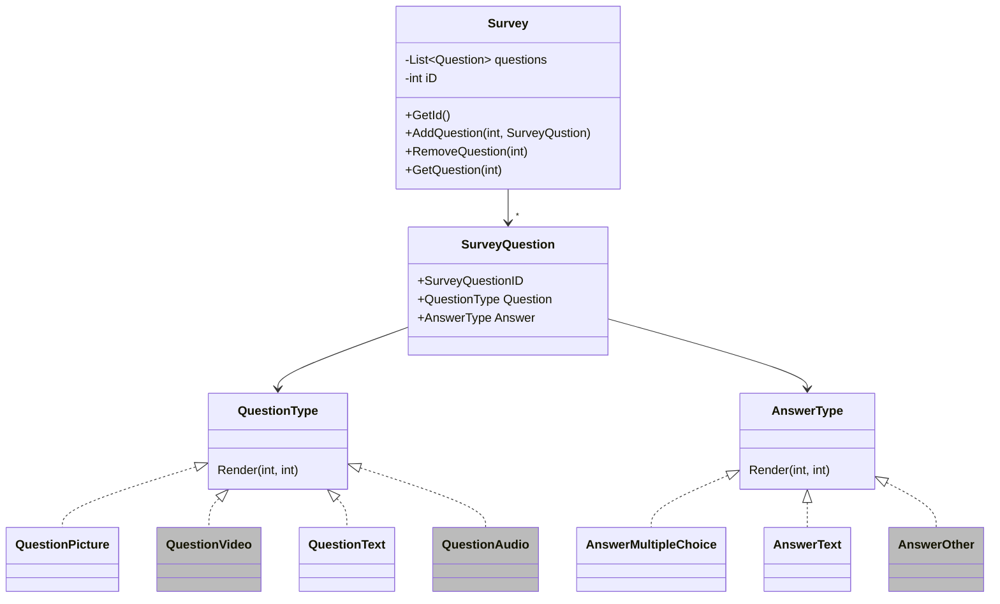

```mermaid
classDiagram
    class Survey{
        -List~Question~ questions
        -int iD
        +GetId()
        +AddQuestion(int, SurveyQustion)
        +RemoveQuestion(int)
        +GetQuestion(int)
    }
        
    class SurveyQuestion{
        +SurveyQuestionID
        +QuestionType Question
        +AnswerType Answer
    }

    class QuestionType{
        Render(int, int) 
    }
    class AnswerType{
        Render(int, int) 
    }
    class QuestionVideo
    style QuestionVideo fill:#bbb
    class QuestionAudio
    style QuestionAudio fill:#bbb
    class AnswerOther
    style AnswerOther fill: #bbb

    Survey --> "*" SurveyQuestion
    SurveyQuestion -->  QuestionType
    SurveyQuestion --> AnswerType
    QuestionType <|.. QuestionPicture
    QuestionType <|..  QuestionVideo 
    QuestionType <|.. QuestionText
    QuestionType <|.. QuestionAudio
    AnswerType <|.. AnswerMultipleChoice
    AnswerType <|.. AnswerText
    AnswerType <|.. AnswerOther
    
```